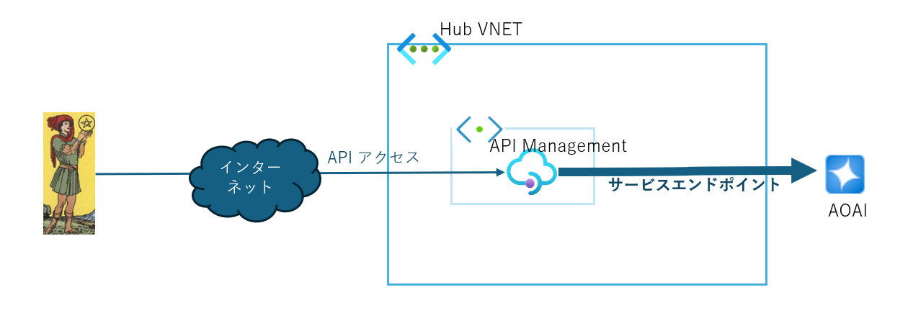

# 開発チーム(SA チーム)向けに AOAI の API 公開について、考えてみた

プラットフォームエンジニアリングの業務に携わる中で、開発チーム(SA チーム)向けにどういうサービスを提供したらいいかと考えた時に、これからは DevOps に AI がどんどん活用されていくと思い、個人的な趣味で、Azure Open AI Service(AOAI)の API 公開について考察＆検証してみました。

## SA チーム向け AOAI の API 公開と活用例

[こちらの資料を参照](https://www.docswell.com/s/windagecat/Z3G4E8-2025-02-22-144026)

## テスト用の API 構成のデプロイ

テスト用の API 構成について、terraform コードを用意しました。

### API 構成

#### API 構成



#### 工夫点

- AOAI のモデルバージョンごとに、API のオペレーションを分ける
- AOAI のモデルバージョンの自動アップデートを無効にする
- AOAI の負荷分散の構成
- トークン制限の構成
- 余計な API をブロック
- 監視用ダッシュボードの実装

> 詳細は[SA チーム向け AOAI の API 公開と活用例](./Readme.md#saチーム向けaoaiのapi公開と活用例)を参照

### API 構成のデプロイ

下記に API 構成のデプロイ方法を示します。

```bash
# terraform/local_vars.tfの編
=========================================
locals {
  subscription_id = "<サブスクリプションID>" #サブスクリプションIDを記入
  openai = {
    account = ["primary", "secondary"] # 編集しないこと
    model = {
      # 下記URLを参照して以下aoaiパラメータを入力すること
      # https://learn.microsoft.com/ja-jp/azure/ai-services/openai/concepts/models?tabs=global-standard%2Cstandard-chat-completions#gpt-4
      location   = "eastus2"     # AOAIインスタンスをデプロイする場所
      model      = "gpt-4o-mini" # aoaiモデル
      version    = "2024-07-18"  # aoaiモデルバージョン
      deploytype = "Standard"    # デプロイの種類。可能な値は、Standard, DataZoneStandard, DataZoneProvisionedManaged, GlobalBatch, GlobalProvisionedManaged, GlobalStandard, ProvisionedManaged 。テスト用にはStandardかGlobalStandardが無難。
      capacity   = 48            # 例) 48=48000トークン。AOAIのcapacityについて、https://learn.microsoft.com/ja-jp/azure/ai-services/openai/quotas-limits#regional-quota-limits　参照
    }
  }
......
=========================================
# terraform applyを実行
terraform apply
```

### API 構成の削除

下記に API 構成の削除方法を示します。

```bash
# terraform destroyを実行
terraform destroy
```
